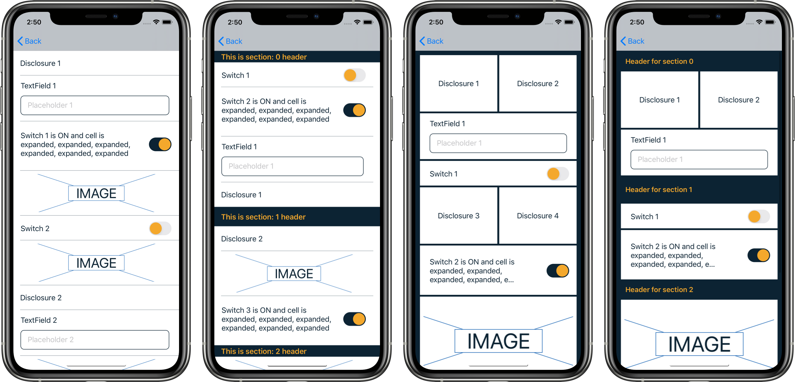

# DKDataSources

[](https://cocoapods.org/pods/DKDataSources)
[](https://cocoapods.org/pods/DKDataSources)
[](https://cocoapods.org/pods/DKDataSources)
[](https://cocoapods.org/pods/DKDataSources)

`DKDataSources` is your neat solution to common problems with multiples cell types in `TableViews` and `CollectionViews`, also provides elegant solution for  `if indexPath.section == 0` alike statements in `cellForRow`, `heightForRow` etc.



And this is all ViewController code in code of the first screenshot:
```swift
lazy var dataSource = DKTableDataSource<CellType>(
    models: [
        DisclosureCellModel(title: "Disclosure 1", action: .action1),
        TextFieldCellModel(title: "TextField 1", placeholder: "Placeholder 1"),
        SwitchCellModel(title: "Switch 1", isOn: true),
        BannerCellModel(imageName: "placeholder"),
        SwitchCellModel(title: "Switch 2", isOn: false),
        BannerCellModel(imageName: "placeholder"),
        DisclosureCellModel(title: "Disclosure 2", action: .action2),
        TextFieldCellModel(title: "TextField 2", placeholder: "Placeholder 2"),
        BannerCellModel(imageName: "placeholder")
    ]
)

// in `viewDidLoad`
dataSource.registerCells(for: tableView)
tableView.dataSource = dataSource
```

# Example

To run the example project, clone the repo, and run `pod install` from the Example directory first.

# Installation

DKDataSources is available through [CocoaPods](https://cocoapods.org). To install
it, simply add the following line to your Podfile:

```ruby
pod 'DKDataSources'
```

# Usage
When using `DKDataSources` you need to meet some requirements to make it work. First of all you need `enum` conforming to `DKCellType` protocol. This `enum` will hold all possible `cells` and additional info for every cell for register and dequeue.

```swift
enum CellType: DKCellType {
    case `switch`(SwitchCellModel)

    var info: (cellClass: AnyClass, identifier: String) {
    switch self {
    case .switch:
        return (cellClass: SwitchCell.self, identifier: NSStringFromClass(SwitchCell.self))
    }
}
```


Every `cell` needs corresponding `model` to be configured with. This model needs to inherit from generic class `DKCellModel<>` where type is your previously created `enum` so for now its `DKCellModel<CellType>`. Then you need to `override` property `type` and set it to corresponding cell type. In this case `CellType.switch` has associated value of type `SwitchCellModel` so we pass there `self`. 


```swift
final class SwitchCellModel: DKCellModel<CellType> {
    override var type: CellType { .switch(self) }

    let title: String
    var isOn: Bool

    init(title: String, isOn: Bool) {
    self.title = title
    self.isOn = isOn

    }
}
```

When you have your `CellType` and `CellModel` all you need now is your cell (obviously). Every `cell` needs to conform `DKTableConfigurableCell` protocol, this will force you to implement `configure` which is called in `cellForRow`, you also need to `cast` model here to your cell corresponding model so you have access to concrete properties.

```swift
extension SwitchCell: DKTableConfigurableCell {

    func configure<T>(with model: T) where T : DKCellModelProtocol {
        guard let model = model as? SwitchCellModel else { return assertionFailure() }
    
        titleLabel.text = model.title
        switchView.isOn = model.isOn
    }
}
```

You are done now. And this is all you need to do in your controller to have infinite types of cells in it, even in one section. 

```swift
lazy var dataSource = DKTableDataSource<CellType>(
    models: [
        TextFieldCellModel(title: "TextField 1", placeholder: "Placeholder 1"),
        SwitchCellModel(title: "Switch 1", isOn: true)
    ])

// in `viewDidLoad`
dataSource.registerCells(for: tableView)
tableView.dataSource = dataSource
```

`DKTableDataSource` have closures in initializer for all `UITableViewDataSource` methods, you can do some additional setups there if needed.

```swift
lazy var dataSource = DKTableDataSource<CellType>(
    models: [
        SwitchCellModel(title: "Switch 1", isOn: true),
    ],
    
    configureCell: { (model, cell) in
        
        if let cell = cell as? SwitchCell {
            cell.delegate = self
        }
        
        cell.configure(with: model)},
    
    titleForHeaderInSection: { _, section in "Section Header Title" },
    titleForFooterInSection: { _, section in "Section Footer Title" },
    canEditRowAtIndexPath: { _, indexPath in false },
    canMoveRowAtIndexPath: { _, indexPath in false }
)
```

## TableView with more sections
Just use `DKSectionedTableViewDataSource<>` as below.

```swift
lazy var section1DataSource = DKTableDataSource<CellType>(
    models: [
        DisclosureCellModel(title: "Disclosure 1", action: .action1),
        SwitchCellModel(title: "Switch 1", isOn: true),
    ])

lazy var section2DataSource = DKTableDataSource<CellType>(
    models: [
        BannerCellModel(imageName: "placeholder"),
    ])

lazy var dataSource = DKSectionedTableViewDataSource<CellType>(
    dataSources: [section1DataSource, section2DataSource]
)

// in `viewDidLoad`
dataSource.registerCells(for: tableView)
tableView.dataSource = dataSource
```

`DKSectionedTableViewDataSource` also provides closures in initializer.

```swift
lazy var dataSource = DKSectionedTableViewDataSource<CellType>(
    dataSources: [section1DataSource, section2DataSource, section3DataSource],
    
    configureCell: { (model, cell) in
        
        if let cell = cell as? SwitchCell {
            cell.delegate = self
        }

        cell.configure(with: model)},
    
    sectionIndexTitles: { _ in ["A", "B", "C"] },

    sectionForSectionIndexTitle: { _, title, index in index }
)
```

## Collection View
Every thing works the same as for `TableView` but you need to use: 

- `DKCollectionConfigurableCell` instead of `DKTableConfigurableCell`
- `DKCollectionDataSource` instead of `DKTableDataSource`
- `DKSectionedCollectionDataSource` instead of `DKSectionedTableViewDataSource`

All cases are covered in Example project.

## Author

Denis Kakačka, deniskakacka@gmail.com

## License

DKDataSources is available under the MIT license. See the LICENSE file for more info.
